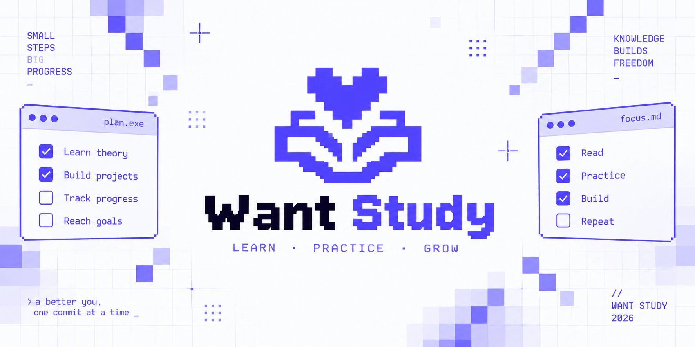

<picture>
  <source media="(prefers-color-scheme: dark)" srcset="assets/cover_dark.png">
  <source media="(prefers-color-scheme: light)" srcset="assets/cover_light.png">
  
</picture>

# Want Study

Turn learning material into a working knowledge base.

Want Study is a macOS desktop app for self-directed learning from courses,
books, articles, and videos. It keeps notes, practice, progress, and concepts
next to the lessons they belong to. Your study data stays in local PostgreSQL;
publishing to GitHub happens only when you start it.

## Why it exists

Learning rarely happens in one place. The material lives in a browser or a
book, notes in Markdown files, homework in another folder, and progress in your
head. Want Study connects these parts so every lesson leaves a useful result.

- Capture knowledge while the context is fresh.
- Keep theory, homework, and code together.
- See what you started, what needs practice, and what you mastered.
- Connect recurring ideas instead of collecting isolated notes.
- Publish a readable study repository without maintaining its structure by hand.

## What you can do

**Organize the material.** Build a clear hierarchy of studies, sources,
sections, and lessons. Move through four explicit lesson states: planned,
studying, homework, and mastered.

**Write focused notes.** Edit Markdown as a continuous document, switch to a
clean reading mode, use slash commands, and attach source links to individual
blocks.

**Practice next to theory.** Keep homework prompts, solutions, deadlines, and
UTF-8 code files inside the lesson. Material progress and homework progress stay
separate, so one number never hides unfinished work.

**Build connected knowledge.** Create concepts, aliases, relations, and
backlinks. Search the knowledge graph and see where each concept appears in your
notes.

**Publish with control.** Preview a deterministic English Markdown export before
writing files. Want Study checks the Git repository, protects unrelated files,
commits managed paths, pushes the current branch, and lets you retry a failed
push without creating another commit.

## How it works

- **Flutter Desktop** provides the dark macOS workspace and local Git workflow.
- **Go and gRPC** enforce application rules and render Markdown snapshots.
- **PostgreSQL** is the single source of truth for studies and progress.
- **Docker Compose** runs the API and database; the app connects through
  `127.0.0.1:50051` and checks the standard gRPC health endpoint.
- **Local diagnostics** keep logs on the machine without remote telemetry.

## Run locally

Requirements: macOS, Docker, and FVM 3.2.1 or newer.

```shell
make bootstrap
docker compose up -d --build
cd app/desktop
fvm flutter run -d macos
```

The API applies PostgreSQL migrations on startup. To stop the local services,
run `docker compose down` from the repository root.
